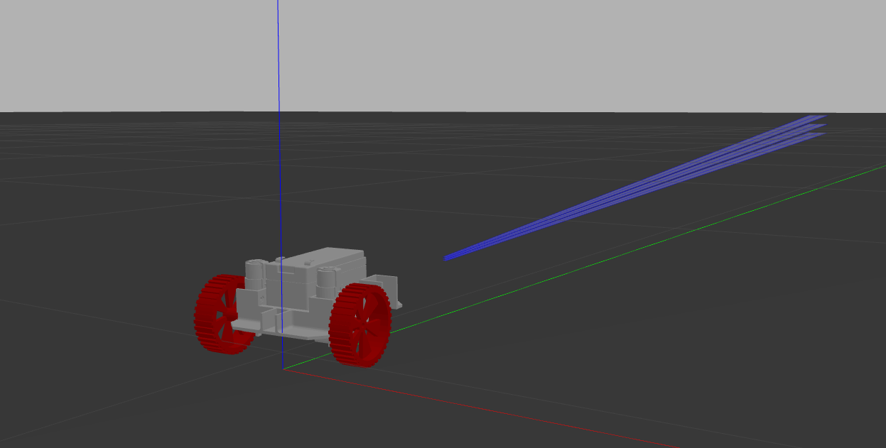
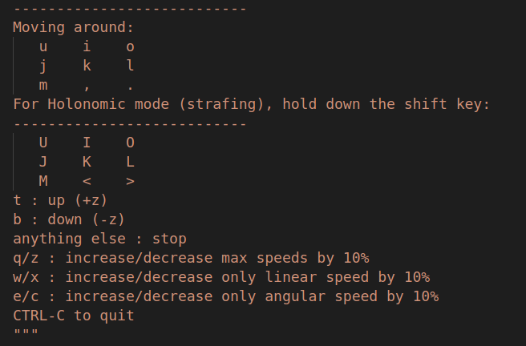

# uavionics_workshop2 (Control robot in ROS with implementation of roslaunch & rosservice)
### NTU Uavionics Club
### Nanyang Technological University Singapore

This is an ros-package created for NTU Uavionics ROS Workshop 2. This repository assumes readers have a complete ROS1 environment (i.e Ubuntu or VMware) or run this package at a ROS simulation platform such as TheConstructSim.

This package is created for ROS-Noetic.

The car model is designed in Solidworks with the help of SW2URDF(http://wiki.ros.org/sw_urdf_exporter) plugin which generates the URDF of the robot to be runned in Gazebo simulator.

# Installation #

Make sure you've installed ROS (Noetic) and Gazebo on your systems.

Open a terminal.
1. Initiate a workspace in your home directory or use your existing favorite one.
```
source /opt/ros/noetic/setup.bash 

mkdir -p ~/catkin_ws/src
cd ~/catkin_ws/src
catkin_init_workspace
```

2. Clone this repo into the src folder and build the package.
```
git clone https://github.com/Junszz/uavinoics_workshop2
catkin build
```

3. You may add the workspace to your linux environment by sourcing the setup file to .bashrc so that you don't have to source the setup.bash file everytime you open a new terminal. You can do this by running the following command:
```
echo "source ~/(YOUR WORK SPACE)/devel/setup.bash" >> ~/.bashrc
```
As an example:
```
echo "source ~/catkin_ws/devel/setup.bash" >> ~/.bashrc
```
**Otherwise**, do the following whenever you open a new terminal, replace <> with your workspace name
```
source ~/<your_workspace_name>/src/devel/setup.bash
```

4. Launch the package.

The package you have cloned should be able to launch properly with the following command:
```
roslaunch uavionics_workshop2 gazebo.launch
```
This should load the robot car.



If any error appears, please check if the package has been built successfully and is in the right directory!


5. To fix the error when loading joint_velocity controller(ex: cannot load jointL_velocity_controller & jointR_velocity_controller), try to install the following ros pacakges.

**NOTE: replace "noetic" with your ros distro if you are using another ros version.**

```
sudo apt-get install ros-noetic-gazebo-ros-pkgs ros-noetic-gazebo-ros-control
sudo apt-get install ros-noetic-velocity-controllers
```

Then open a new terminal and try again.

6. Make all the python scripts executable by:

```
cd ~/catkin_ws/src/uavionics_workshop2/scripts/
chmod +x keyboard_teleop.py
chmod +x control.py

```
**or**, do it with one line
```
cd ~/catkin_ws/src/uavionics_workshop2/scripts/
chmod +x *

```

7. You can control the robot car by either using tele-operation (running the keyboard_teleop.py script) or complete the autonomous driving script.



8. Control the robot car by running the dummy autonomous driving script.

```
rosrun uavionics_workshop2 auto.py
```
Next, the terminal should come out "Please start the service". To run the service, start the service by typing in a new terminal.
**The service name set in this workshop is LetsGo **

```
rosservice call LetsGo "data:true"
```

9. Try to ammend the code by yourselves to tune the velocity and orientation
